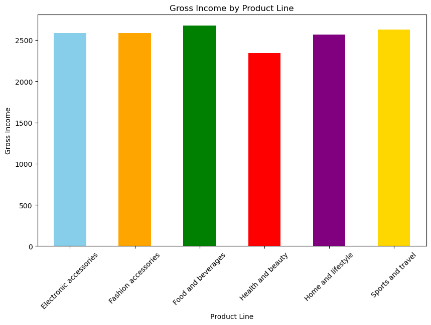
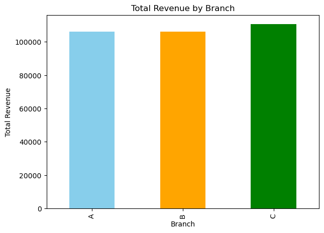
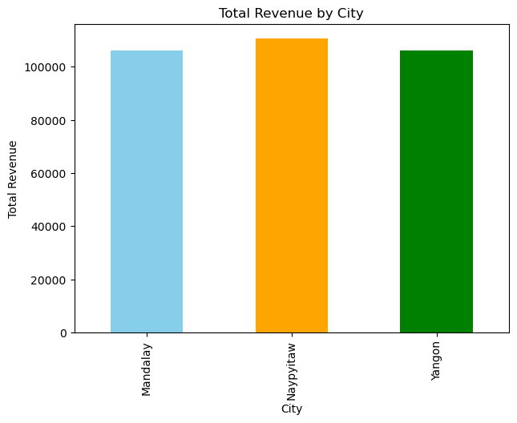
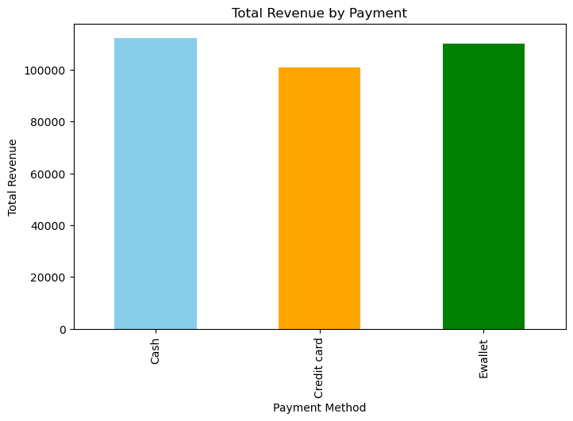
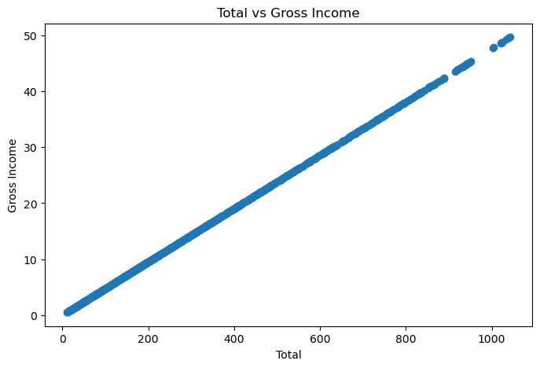
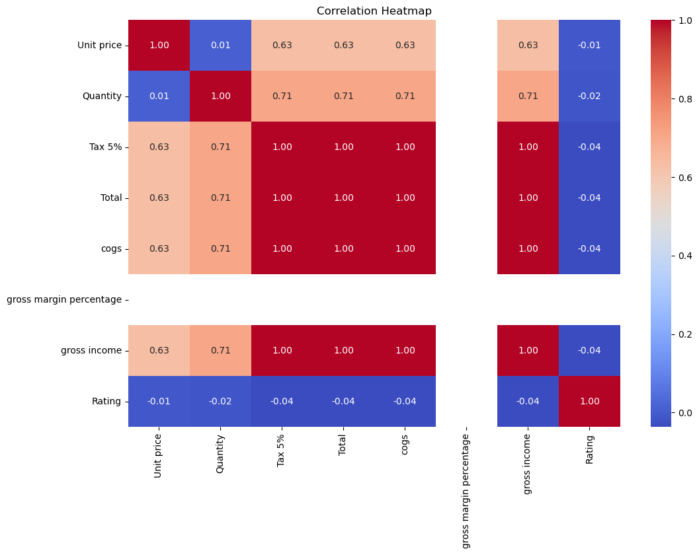
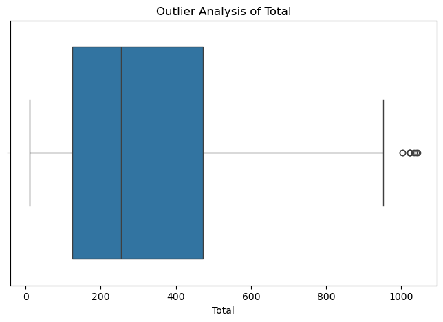

# Sales Data Analysis

## 📌 Project Overview

This project analyzes supermarket sales data to understand sales performance, product performance, customer behavior, payment methods, and profitability.

The analysis uses Python, Pandas, Matplotlib, and Seaborn to perform data cleaning, exploratory data analysis, visualization, correlation analysis, and business insight generation.

## 🎯 Business Objective

The objective of this project is to analyze sales data to identify revenue trends, product performance, branch and city performance, customer behavior, and payment patterns. The analysis uses exploratory data analysis and visualization to generate meaningful business insights that can support data-driven decision-making.

## 🎯 Objectives

- Analyze overall sales performance
- Identify high-performing product lines
- Compare revenue and quantity sold across product categories
- Analyze branch and city performance
- Understand customer behavior by gender
- Analyze revenue by payment method
- Study the relationship between sales and gross income
- Identify correlations between numerical variables
- Detect potential outliers
- Generate actionable business insights

## 📂 Dataset

The project uses a supermarket sales dataset containing transaction-level information such as:

- Branch
- City
- Customer type
- Gender
- Product line
- Unit price
- Quantity
- Tax
- Total
- Payment method
- Rating
- Gross income

## 🛠️ Technologies Used

- **Programming:** Python
- **Libraries:** Pandas, Matplotlib, Seaborn
- **Data Analysis:** Exploratory Data Analysis (EDA)
- **Visualization:** Matplotlib, Seaborn
- **Environment:** Jupyter Notebook

## 🔄 Project Workflow

1. Import required libraries
2. Load the dataset
3. Understand the dataset structure
4. Check data types and statistical summary
5. Check missing values and duplicate records
6. Analyze categorical variables
7. Remove duplicate records
8. Perform exploratory data analysis
9. Analyze sales performance
10. Analyze product performance
11. Analyze branch and city performance
12. Analyze customer behavior
13. Analyze payment methods
14. Perform relationship and correlation analysis
15. Perform outlier analysis
16. Generate business insights

## 🧹 Data Cleaning

The dataset was checked for:

- Missing values
- Duplicate records
- Data types
- Unique values
- Categorical variables

Duplicate records were removed before performing the main analysis.

## 📊 Sales Analysis

The project calculates:

- Total revenue
- Average transaction value
- Total quantity sold

These metrics provide an overview of the overall sales performance.

## 🛍️ Product Analysis

Product performance is analyzed using:

- Revenue by product line
- Quantity sold by product line
- Gross income by product line
- Average customer rating by product line

## 🏢 Branch & City Analysis

Revenue is compared across:

- Different branches
- Different cities

This helps identify differences in sales performance across locations.

## 👥 Customer Analysis

Customer-related analysis includes:

- Revenue by gender
- Average rating by gender

These analyses help understand customer purchasing and rating patterns.

## 💳 Payment Analysis

Revenue is analyzed across different payment methods to understand payment preferences and their contribution to total sales.

## 🔗 Relationship Analysis

The project examines:

- Relationship between Total Sales and Gross Income
- Distribution of Quantity

Scatter plots and histograms are used for visualization.

## 📈 Correlation Analysis

A correlation matrix and heatmap are used to analyze relationships between numerical variables.

## 📦 Outlier Analysis

Boxplots are used to identify potential outliers in:

- Total Sales
- Gross Income

  ## 🔍 Key Findings

- Identified important **revenue trends** across products and business locations.
- Analyzed **product-line performance** to understand sales contribution.
- Compared **branch and city performance** to identify differences in sales.
- Examined **customer behavior and payment methods** to understand purchasing patterns.
- Used correlation and outlier analysis to identify relationships and unusual observations in the dataset.

## 💡 Business Insights

The analysis is used to identify:

- Highest revenue-generating product line
- Product line with the highest quantity sold
- Most profitable product line
- Best-performing branch
- Best-performing city
- Customer rating patterns
- Payment method contribution

## 📊 Project Visualizations

### Revenue by Product Line

### Gross Income by Product Line

### Revenue by Branch

### Revenue by City

### Revenue by Payment Method

### Total Sales vs Gross Income

### Correlation Heatmap

### Outlier Analysis

👩‍💻 Author

Shabeena Bano

GitHub: https://github.com/shabeenabano

LinkedIn: https://www.linkedin.com/in/shabeena-bano-49861542b/
